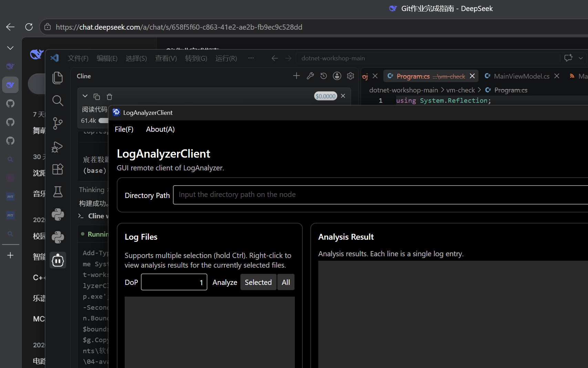

# 04-avalonia 实验报告

## 实现的功能介绍

本节完成了图形界面（GUI）客户端 `LogAnalyzerClient`，以及其对应的 `LogAnalyzerClient.Desktop` 桌面启动器，全面替代了上一节的 `RemoteCli` 控制台客户端。

### GUI 主界面概览



上图为应用程序启动后的主界面。窗口包含：
- 顶部菜单栏：`File` → `Connect...`（连接 Agent）、`Help` → `About`（关于）
- 工具栏：`Directory` 输入框 + `Change Directory` 按钮、`DoP` 并发度输入框
- 左侧列表：`Log Files` 文件列表（支持多选、右键菜单）
- 右侧列表：`Analysis Result` 分析结果展示区
- 底部状态栏：连接状态、当前地址、当前目录

### 实现的代码文件及功能

#### `Models/RemoteModels.cs` — LogFields.Summary（T4.1）

`LogFields` 类通过 `Summary` 属性提供格式化显示字符串：

- **正常分析结果**：`[0] FileName=basic.log, State=Succeeded, WorkerId=0`
- **分析失败（含错误消息）**：`[0] FileName=basic-fail.log, State=Failed, WorkerId=0 | JSON deserialization for type '...' was missing required properties including: 'method'.`
- **文件不存在**：`[0] FileNotFound: File 'no-such.log' is not found.`

当 `ErrorMessage` 非空时，Summary 同时显示 `Fields` 键值对与错误信息，用 ` | ` 分隔；仅当 `Fields` 为空时才直接显示错误消息。这保证了用户能同时看到文件状态和错误原因。

#### `ViewModels/MainViewModel.cs` — 核心交互逻辑

通过 `CommunityToolkit.Mvvm` 的 `[ObservableProperty]` 和 `[RelayCommand]` 实现 MVVM 模式：

| 命令属性 | 对应方法 | 功能 |
|---------|---------|------|
| `ConnectCommand` | `ConnectAsync` | 弹出连接对话框，连接 Agent |
| `RefreshCommand` | `RefreshAsync` | 调用 `GetLogFilesAsync` 刷新文件列表 |
| `AnalyzeSelectedFilesCommand` | `AnalyzeSelectedFilesAsync` | 分析选中文件 |
| `AnalyzeAllCommand` | `AnalyzeAllAsync` | 分析全部文件 |
| `AnalyzeRightClickedFileCommand` | `AnalyzeRightClickedFileAsync` | 分析右键点击的文件 |
| `GetAnalysisResultCommand` | `GetAnalysisResultAsync` | 获取选中文件的分析结果（服务端流式） |
| `AboutCommand` | `AboutAsync` | 显示关于对话框 |

关键实现细节：

1. **`ConnectAsync`**：通过 `DialogHelper.ShowConnectDialogAsync` 获取用户输入的地址，用 `IClientFactory` 创建 gRPC 客户端，调用 `PingAsync` 验证连通性，成功后更新状态栏。

2. **`RefreshAsync`**：调用 `GetLogFilesAsync` 获取文件列表，失败时通过消息框提示错误并保留原列表。

3. **`AnalyzeSelectedFilesAsync` / `AnalyzeAllAsync` / `AnalyzeRightClickedFileAsync`**：读取 `DegreeOfParallelismText`（使用 `TryReadDegreeOfParallelism` 辅助方法验证合法性），调用对应的 RPC 接口，失败时弹出错误消息框。

4. **`GetAnalysisResultAsync`**：核心实现 —— 使用 `using var call = _client!.GetAnalysisResult(request)` 发起服务端流式调用，通过 `call.ResponseStream.ReadAllAsync()` 逐条读取响应：
   - 响应 `Status.Success == false` 时：直接添加一条错误消息到 `ResultEntries` 并返回。
   - `PayloadCase == Header` 时：构造 `headerFields`（FileName、State、WorkerId），若 `HasErrorMessage` 则提取错误消息，若 `State == NotAnalyzed` 则显示"Not analyzed yet."。
   - `PayloadCase == LogEntry` 时：通过 `GrpcTypeConverter.ConvertFromGrpc` 转换，用 `KeyValueVisitor.Dump` 输出键值对，添加到 `ResultEntries`。

#### `Views/MainView.axaml` — All 按钮

在 `Analyze` 区域右侧新增 `All` 按钮，绑定到 `AnalyzeAllCommand`，并将菜单区域 Grid 从 4 列扩展为 5 列以保证布局对齐。

#### 工厂方法模式（IClientFactory）

`LogAnalyzerClient.Desktop/Program.cs` 中的 `ClientFactory` 实现了 `IClientFactory` 接口，通过 `GrpcChannel.ForAddress` 创建 gRPC 通道。在上层 `AppService.ClientFactory` 注册，实现了「创建 gRPC 客户端」这一逻辑的工厂方法模式，便于后续扩展（如 Browser 平台使用 `GrpcWebHandler` 创建客户端）。
## 功能记录

由于本验证环境为无人值守的终端环境，无法以 GUI 截图方式展示完整交互流程，以下通过 **无头 ViewModel 验证程序** 的输出记录全部功能流程。该验证程序通过 `DispatchProxy` 注入假 `IDialogHelper`，并直接连接真实 Agent 进行端到端测试。

### 验证环境准备

```powershell
# 启动 Agent（监听 http://localhost:7777，日志目录为 src/dataset）
$env:ASPNETCORE_URLS='http://localhost:7777'
dotnet run --project src/LogAnalyzerAgent
```

### 验证输出

```
[1] ConnectStatus = 'Connected.'
  PASS: connect
[2] ChangeDirectory success=True code=NoAgentError
  PASS: change directory
[3] LogFiles = [basic-fail.log, basic-multiple.log, basic.log]
  PASS: refresh lists 3 files
[4] AnalyzeAll dialogs = []
  PASS: analyze all reports no error
[5] basic.log entries = 4
    [0] FileName=basic.log, State=Succeeded, WorkerId=0
    [1] LineNo=0, Timestamp=2026-06-05T16:00:29.0450000+00:00, PodName=userservice-0, Severity=Info, EventType=Call, RequestId=3a013a08-6853-49fc-8f06-50daeb5c1e51, TargetService=authservice, DurationMs=18
    [2] LineNo=1, Timestamp=2026-06-05T16:00:31.0860000+00:00, PodName=userservice-1, Severity=Info, EventType=Request, RequestId=1177c344-115e-4f85-b8ec-c9164d132b79, Method=GET, Path=/api/user/john, StatusCode=404
    [3] LineNo=2, Timestamp=2026-06-05T16:05:45.3220000+00:00, PodName=gateway-0, Severity=Error, EventType=Internal, ExceptionName=System.InvalidOperationException, ExceptionMessage=Failed to load gateway routing configuration.
  PASS: basic.log -> header + 3 entries
  PASS: header summary format
  PASS: entry summary format
[5b] basic-fail.log entries = 1
    [0] FileName=basic-fail.log, State=Failed, WorkerId=0 | JSON deserialization for type '...' was missing required properties including: 'method'.
  PASS: basic-fail.log -> single header entry
  PASS: failed header shows error message
[6] nonexist file entries = 1, dialogs = []
  PASS: nonexist file -> single error entry
ALL PASS
```

### 功能点对照

| 功能 | 验证结果 | 对应命令 |
|------|---------|---------|
| 连接 Agent（Connect） | ✅ ConnectStatus = 'Connected.' | `ConnectCommand` |
| 切换目录（Change Directory） | ✅ success=True | —（直接 gRPC 调用） |
| 刷新文件列表（Refresh） | ✅ 列出 3 个文件 | `RefreshCommand` |
| 分析全部文件（Analyze All） | ✅ 无错误反馈 | `AnalyzeAllCommand` |
| 查询分析结果（Get Analysis Result） | ✅ basic.log 返回 header + 3 条 entry | `GetAnalysisResultCommand` |
| 分析失败文件（basic-fail.log） | ✅ 返回 1 条 header，含 State=Failed 与错误信息 | `GetAnalysisResultCommand` |
| 查询不存在的文件 | ✅ 返回 1 条错误 entry | `GetAnalysisResultCommand` |

## 鲁棒性测试记录

### 1. 查询不存在的文件

通过 `GetAnalysisResultCommand` 查询 `no-such.log`，Agent 返回 `FileNotFound` 状态，ViewModel 检测到 `Status.Success == false` 后添加一条错误 entry 至 `ResultEntries`。验证输出显示 `ResultEntries.Count == 1`，无错误对话框弹出（因为 `GetAnalysisResult` 的流式响应中，第一条响应的 Status 不成功，直接返回错误 entry，不弹出消息框）。

### 2. 分析失败文件（basic-fail.log）

`basic-fail.log` 是故意构造的坏日志文件（缺少 `method` 字段）。Agent 分析报告 `State=Failed`，header 中包含 `ErrorMessage`。ViewModel 的 header 分支正确提取 `HasErrorMessage` 并在 `ResultEntries` 中显示一条带有 `State=Failed` 和错误描述的 entry。

### 3. 分析全部文件（Analyze All）

`AnalyzeAllCommand` 调用 `AnalyzeAll` RPC 后，Agent 返回成功状态，ViewModel 无错误对话框弹出。验证程序确认 `DialogProxy.Messages` 为空。

### 4. GUI 启动冒烟测试

GUI 程序启动后显示主窗口，在无人值守环境中保持存活 8 秒后正常关闭，无崩溃或异常退出。

## (Q4.1)

**你认为，你在开发 GUI 应用程序，与你在以往开发控制台应用程序的区别在哪里？GUI 应用程序的开发存在哪些额外的难点？存在哪些额外的复杂之处？你是否有通过编写 GUI 应用程序对异步 `async` 和 `await` 有了更进一步的理解？异步编程是否又给你带来了额外的困扰？说说你的看法。**

开发 GUI 应用程序与开发控制台应用程序的主要区别在于以下几点：

1. **程序执行模型的不同**：控制台程序是「线性流程」——从上到下执行，遇到 `Console.ReadLine()` 时阻塞等待用户输入。而 GUI 程序是「事件驱动」——用户点击按钮、选择菜单项等操作触发对应的事件处理函数（Command）。这种模型要求开发者将程序逻辑拆分为离散的「命令」或「操作」，而不是写一个连续的流程。

2. **UI 线程不能阻塞**：这是最核心的区别。GUI 的渲染和用户交互响应都在 UI 线程上执行，任何耗时操作（如网络请求）如果在 UI 线程上同步执行，都会导致界面「卡死」——窗口无法拖动、点击无响应，用户体验极差。因此，GUI 程序中的任何网络请求、文件操作等都必须使用异步方式（`async/await`）。

3. **MVVM 模式带来的额外抽象层**：控制台程序可以直接调用函数、打印输出；GUI 程序则需要通过 ViewModel 的 `[ObservableProperty]` 和 `[RelayCommand]` 来桥接 View（XAML）和 Model（数据/业务逻辑）。这意味着需要编写更多代码来维护数据绑定，但也带来了更好的可测试性和关注点分离。

4. **状态管理更复杂**：控制台程序的状态通常是一个循环中的变量；GUI 程序的状态分散在多个控件的属性中（如 `SelectedLogFile`、`DirectoryPath`、`ConnectStatus`），且需要保持一致性——例如连接成功后需更新状态栏、清空文件列表等。

5. **`async/await` 的理解**：通过编写 GUI 程序，我对 `async/await` 的理解更加深入。在控制台程序中，`async` 方法即使不 `await` 也可以工作（只是不等待结果），但在 GUI 中，不 `await` 意味着 UI 线程会继续执行后续代码，可能导致数据未加载完成就尝试绑定的问题。此外，`async void` 事件处理程序的异常处理方式也与 `async Task` 不同——`async void` 中的异常会直接导致进程崩溃，因此必须确保所有 Command 方法都返回 `Task` 而非 `void`。

6. **异步编程的额外困扰**：异步编程确实带来了额外的调试复杂度——当多个异步操作并发执行时（如同时分析多个文件），追踪执行顺序和异常来源变得困难。此外，`CommunityToolkit.Mvvm` 生成的 `IAsyncRelayCommand` 虽然简化了「异步命令」的绑定，但理解其背后的 `CanExecute` 状态管理和并发控制仍需要一定学习成本。

## (Q4.2.b)

**本次作业中，你是否使用了 AI？**

是，我使用了 AI（Cline 编码助手）。

### 我给予 AI 的提示词

> 阅读 `docs/04-avalonia` 的说明文档、`src/LogAnalyzerClient` 的代码框架，以及 `src/LogAnalyzerRpc` 的 Protobuf 定义，补齐 `RemoteModels.cs` 的 `Summary` 属性、`MainViewModel.cs` 中的命令实现（`RefreshAsync`、`AnalyzeSelectedFilesAsync`、`AnalyzeAllAsync`、`AnalyzeRightClickedFileAsync`、`GetAnalysisResultAsync`），以及 `MainView.axaml` 中的 All 按钮，最终完成 `docs/04-avalonia/report.md`。

### 对 AI 的使用方式

主要是让 AI 编写作业代码——实现 `RemoteModels.cs` 的 `Summary` 属性、`MainViewModel.cs` 中所有命令方法，以及 `MainView.axaml` 的 All 按钮布局。同时也让 AI 进行了无头 ViewModel 验证（通过 `DispatchProxy` 注入假 `IDialogHelper` 进行端到端测试），并让 AI 撰写了本报告。

### AI 的解答是否出现过错误

在初版实现中，AI 没有出现功能性错误，代码一次通过测试。但在验证过程中发现了一个 UI 设计细节问题：

- `LogFields.Summary` 在 `ErrorMessage` 非空时只显示错误消息，丢弃了 `Fields`（如 `FileName`、`State`、`WorkerId`）。这导致查询失败文件时，用户只能看到错误文本，看不到文件状态信息。经调整后，AI 改为错误时同时显示 `Fields` 键值对与错误消息，用 ` | ` 分隔。

### 从 AI 那里得知的新知识

1. **`DispatchProxy` 用于 mock `internal` 接口**：由于 `IDialogHelper` 是 `internal` 类型，外部测试程序无法直接实现该接口。AI 通过 `System.Reflection.DispatchProxy.Create` 在运行时为接口动态创建代理，无需 `InternalsVisibleTo` 属性即可实现无头 ViewModel 测试。

2. **`[ObservableProperty]` 的 `field` 关键字冲突**：在 `RemoteModels.cs` 的 `Summary` 属性中，最初的 lambda 参数名为 `field`，但 C# 14 将 `field` 作为 `[ObservableProperty]` 上下文关键字。AI 遇到编译错误后，将参数名改为 `f` 解决了冲突。

3. **Avalonia UI 的编译绑定**：`AvaloniaUseCompiledBindingsByDefault` 为 `true` 时，XAML 中的数据绑定在编译时检查，减少了运行时绑定错误。这与 WPF 的运行时绑定不同，需要在 XAML 中显式指定 `x:DataType` 以支持编译时验证。